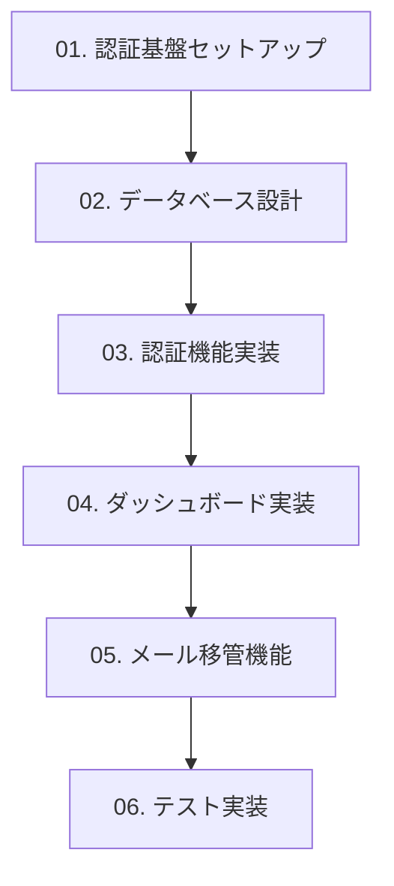

# studyspark-auth-test チケット管理

## 概要
このディレクトリには、studyspark-auth-test プロジェクトの機能実装チケットが連番で整理されています。各チケットには詳細な実装内容と Todo リストが含まれています。

## チケット一覧

| No. | チケット名 | 優先度 | 工数 | ステータス |
|-----|-----------|--------|------|-----------|
| 01 | [認証基盤セットアップ](./01-authentication-setup.md) | 🔥 高 | 8h (2日) | [ ] |
| 02 | [データベース設計・実装](./02-database-design.md) | 🔥 高 | 6h (1.5日) | [ ] |
| 03 | [認証機能実装](./03-authentication-features.md) | 🔥 高 | 12h (3日) | [ ] |
| 04 | [ダッシュボード実装](./04-dashboard-implementation.md) | 🔥 高 | 10h (2.5日) | [ ] |
| 05 | [メール移管機能実装](./05-email-migration.md) | 🔥 高 | 14h (3.5日) | [ ] |
| 06 | [テスト実装](./06-testing-implementation.md) | 🔥 高 | 16h (4日) | [ ] |

**合計見積もり工数**: 66時間 (16.5日間)

## 実装順序



### Phase 1: 基盤構築 (Week 1)
- **01. 認証基盤セットアップ** - Next.js + Supabase 認証の基盤
- **02. データベース設計** - テーブル作成・RLS設定

### Phase 2: コア機能開発 (Week 2-3)
- **03. 認証機能実装** - ログイン・登録・セッション管理
- **04. ダッシュボード実装** - 検証用の管理画面

### Phase 3: 高度機能・検証 (Week 4-5)
- **05. メール移管機能** - プロジェクトのメイン検証項目
- **06. テスト実装** - 品質保証・E2Eテスト

## 進捗管理

各チケットのTodoリストで進捗を管理します：
- `[ ]` : 未着手
- `[×]` : 完了

### 例
```markdown
### Server Actions 実装
- [×] lib/auth/actions.ts ファイル作成
- [×] 保護者ログイン機能実装
- [ ] 生徒ログイン機能実装
- [ ] パスワードリセット機能実装
```

## 技術スタック

### フロントエンド
- **Framework**: Next.js 14.2.x (App Router)
- **Language**: TypeScript 5.5.x (strict mode)
- **Styling**: Tailwind CSS
- **Animation**: Framer Motion

### バックエンド・認証
- **Database**: Supabase (PostgreSQL)
- **Authentication**: Supabase Auth + @supabase/ssr
- **Session Management**: Cookie-based (httpOnly, secure)
- **API**: Route Handlers + Server Actions

### 開発・テスト
- **Package Manager**: pnpm or npm
- **Testing**: Jest + Testing Library + Playwright
- **CI/CD**: GitHub Actions
- **Deployment**: Vercel

## 重要な設計原則

1. **Server Components First**: 可能な限りServer Componentsを使用
2. **Progressive Enhancement**: JavaScriptが無効でも基本機能が動作
3. **Type Safety**: TypeScriptによる完全な型安全性
4. **Security by Default**: Supabase Auth Helpersのセキュリティ機能を最大限活用

## Gmail エイリアス運用計画

### テスト用エイリアス
```
管理者メール: admin@gmail.com

開発・テスト用:
- admin+test001@gmail.com  # 単体テスト
- admin+test002@gmail.com  # 統合テスト
- admin+migration@gmail.com # 移管テスト

本番検証用:
- admin+family001@gmail.com # 検証家族1
- admin+family002@gmail.com # 検証家族2
- admin+family003@gmail.com # 検証家族3
```

## 成功基準

### 技術指標
- 認証成功率: > 99%
- 移管成功率: 100%
- データ整合性: 100%
- Server Components 使用率: > 70%
- Type Coverage: 100%

### パフォーマンス
- First Contentful Paint: < 1s
- Time to Interactive: < 2s
- Lighthouse Score: > 90

## 関連ドキュメント

- [CLAUDE.md](../CLAUDE.md) - 開発ガイドライン
- [Next.js App Router Best Practices](https://nextjs.org/docs/app)
- [Supabase Auth with Next.js](https://supabase.com/docs/guides/auth/auth-helpers/nextjs)

## 注意事項

1. **学習機能は実装しない**
   - 本プロジェクトは認証機能の検証のみが目的
   - スパーク、ゴールナビ、リフレクト機能は対象外

2. **セキュリティ優先**
   - 全てのテーブルでRLS有効化
   - 適切な権限分離の実施
   - 監査ログの記録

3. **データベース操作の注意**
   - 本番データへの影響防止
   - 適切なバックアップとロールバック準備

---

*最終更新: 2025年1月*  
*プロジェクト: studyspark-auth-test*